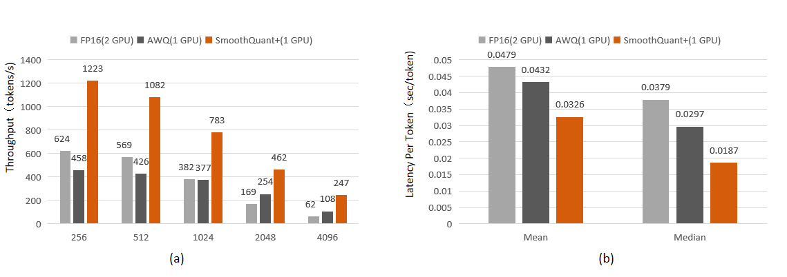

# SmoothQuant+: Accurate and Efficient 4-bit Post-Training WeightQuantization for LLM

[[paper](https://arxiv.org/abs/2312.03788)] 

4-bit weight-only quantization models for code llama  are released in [model zoo](https://github.com/Adlik/model_zoo/tree/main/smooth_quant_plus). You can use [Adlik/vllm](https://github.com/Adlik/vllm/tree/dev) to evaluate.

We will release the code soon, please stay tuned.

```bash
python examples/test_codellama_7b_human_eval.py \
--model-path /path/codellama-7b-base-search-4-bits/ \
--output-path codellama-7b-base-smooth-search \
--quant-mode weight_int4
```




## Abstract

Large language models (LLMs) have shown remarkable capabilities in various tasks. However their huge model size and the consequent demand for computational and memory resources also pose challenges to model deployment. Currently, 4-bit post-training quantization (PTQ) has achieved some success in LLMs, reducing the memory footprint by approximately 75% compared to FP16 models, albeit with some accuracy loss. In this paper, we propose SmoothQuant+, an accurate and efficient 4-bit weight-only PTQ that requires no additional training, which enables lossless in accuracy for LLMs for the first time. Based on the fact that the loss of weight quantization is amplified by the activation outliers, SmoothQuant+ smoothes the activation outliers by channel before quantization, while adjusting the corresponding weights for mathematical equivalence, and then performs group-wise 4-bit weight quantization for linear layers. We have integrated SmoothQuant+ into the vLLM framework, an advanced high-throughput inference engine specially developed for LLMs, and equipped it with an efficient W4A16 CUDA kernels, so that vLLM can seamlessly support SmoothQuant+ 4-bit weight quantization. Our results show that, with SmoothQuant+, the Code Llama-34B model can be quantized and deployed on a A100 40GB GPU, achieving lossless accuracy and a throughput increase of 1.9 to 4.0 times compared to the FP16 model deployed on two A100 40GB GPUs. Moreover, the latency per token is only 68% of the FP16 model deployed on two A100 40GB GPUs. This is the state-of-the-art 4-bit weight quantization for LLMs as we know.


